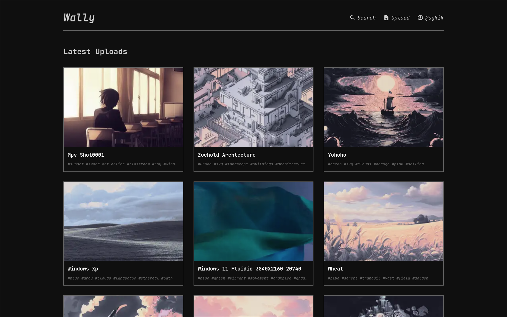
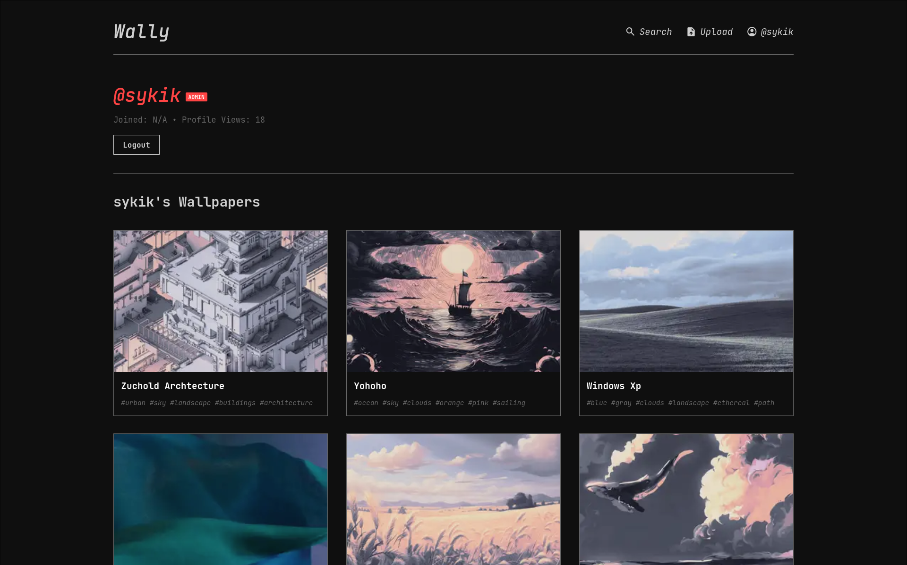
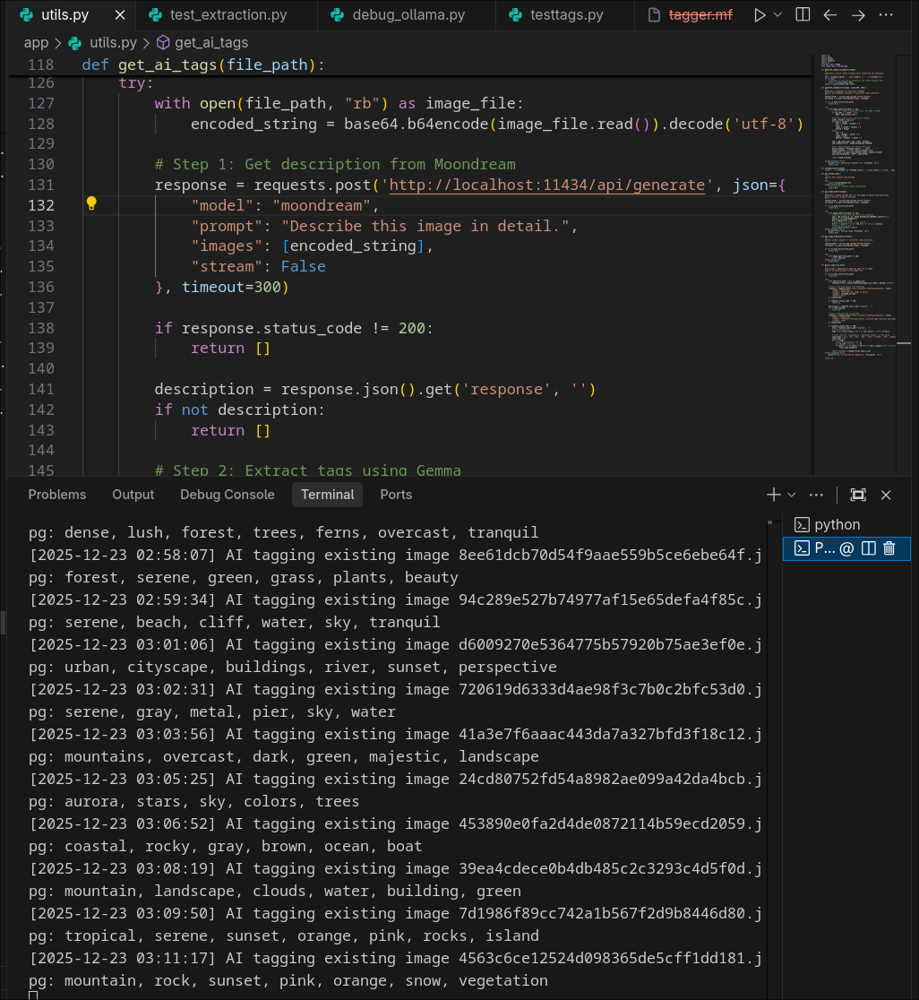
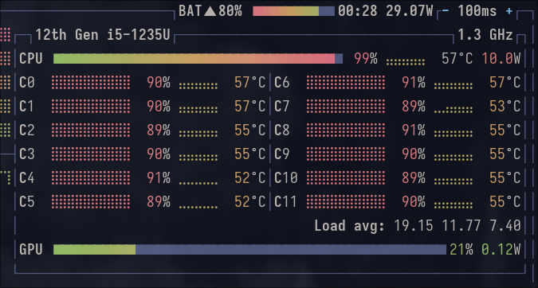

# WALLY - Minimalist Wallpaper Library
#### Video Demo:  [Youtube](https://youtu.be/sqO5mXg_Xow)
#### Live Demo: [Render](https://wally-uwuc.onrender.com)
#### Description:

*Wally* is a clean, beautiful wallpaper library powered by modern AI. It looks like a classic computer terminal—simple and text-based—but uses smart AI to automatically organize your images, making it effortless to use.

### File Breakdown

#### Root Directory
- **`run.py`**: *The main key to start the app.*
- **`config.py`**: *Holds all the settings, like where to save files.*
- **`app.db`**: *The database where user and image info lives.*
- **`maintainance.py`**: *A background worker that checks new files and tags them.*
- **`maintainance_render.py`**: *A lighter version of the worker for cloud hosting.*
- **`tag_git_wallpapers.py`**: *A helper script to make sure our demo images have proper tags.*

#### Application Core (`app/`)
- **`__init__.py`**: *Sets up the app and starts the background worker.*
- **`models.py`**: *Defines what a "User" or "Wallpaper" looks like in the database.*
- **`utils.py`**: *The brain. Handles image safety, thumbnails, and AI tagging.*

#### Routes & Logic (`app/routes/`)
- **`auth.py`**: *Handles logging in and signing up.*
- **`main.py`**: *Controls the home page, uploading, and viewing items.*

#### Templates (`app/templates/`)
- **`base.html`**: *The main layout and design for every page.*
- **`index.html`** & **`wallpaper.html`**: *Pages for browsing and viewing images.*
- **`upload.html`**: *A simple page to drag-and-drop new wallpapers.*

### Design Choices

#### 1. SQLite Database
*I picked SQLite because it's super portable and have previous experience with it because of CS50. It keeps everything in one file, making it easy to share the project or move it around.*

#### 2. The Quarantine System
*Safety Check.* When you upload a file, it goes into "Quarantine" first. A separate process checks it and adds tags before showing it to everyone. This keeps the site fast and safe.

#### 3. AI-Driven Tagging (Ollama)
*Manual tagging is boring.* I used **Ollama** (AI) to look at every picture and describe it. It automatically figures out the best tags, so you can search for "sunset" or "cyberpunk" without anyone typing those words manually.

#### 4. Speed & Performance
*Nobody likes waiting.* The app automatically creates smaller, faster-loading versions (WebP) of every image. We also use "infinite scrolling" so you can keep browsing smoothly.

- **Built by**: Mayank Kushwaha
- **Assists**: Perplexity.ai, Antigravity's Gemini 3 Flash
- **AI Models**: Moondream, Gemma 3 on Ollama

  
   
  
   
  
   
  

